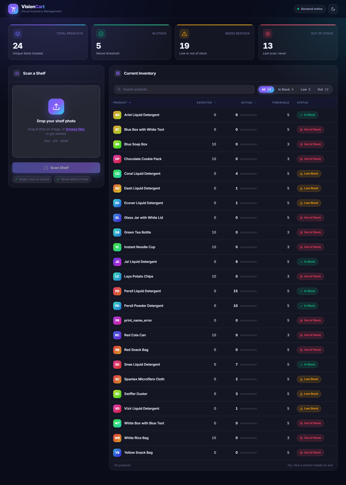
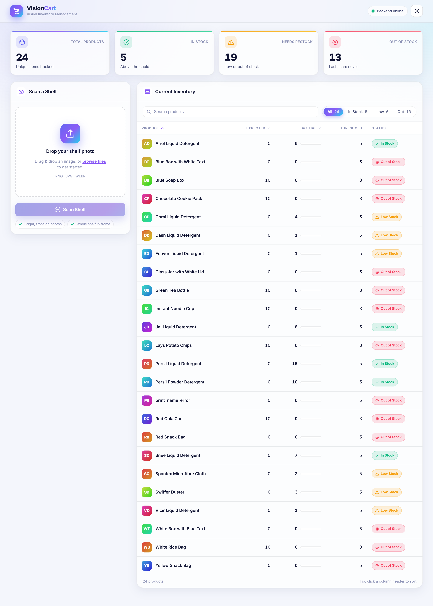
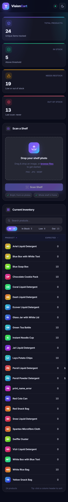

# VisionCart

### Visual Inventory Management System powered by Gemma 4

---

## Overview

Small retail businesses still track shelf stock the old-fashioned way: a person
walks the aisle, counts items by eye, and types the numbers into a spreadsheet
(or worse, a notebook). It's slow, it's error-prone, and by the time the count
is done it's already out of date.

**VisionCart** replaces that manual count with a single photo. Snap a picture
of a shelf, and a vision-language model (Gemma 4) identifies every product on
it and counts how many units are visible. The backend reconciles those counts
against the expected inventory in real time, flags anything running low (or
gone entirely), and surfaces it all on a live dashboard — turning a "cluttered
shelf" photo into organized, actionable inventory data in seconds.

## Screenshots

| Dashboard (dark) | Dashboard (light) |
|:---:|:---:|
|  |  |

<p align="center">
  
</p>
<p align="center"><em>Fully responsive — the layout reflows from a two-column dashboard down to a single stacked column on mobile.</em></p>

## Tech Stack

| Layer | Technology |
|---|---|
| Backend API | [FastAPI](https://fastapi.tiangolo.com/) (Python) |
| Database | SQLite (via SQLAlchemy ORM) |
| AI / Vision | `gemma-4-26b-a4b-it` via the [Google GenAI SDK](https://pypi.org/project/google-genai/) |
| Frontend | Vanilla HTML, CSS, and JavaScript — no framework, no build step |

The frontend is a hand-crafted design system in three static files
(`index.html`, `styles.css`, `app.js`) that talk to the FastAPI backend over
`fetch()`. No bundler, no dependencies — just open the HTML file in a browser.

### Frontend features

- **Drag-and-drop upload** with instant preview and an animated AI "scan" overlay.
- **Live KPI cards** — total products, in-stock, needs-restock, and out-of-stock — with count-up animations and a last-scan timestamp.
- **Searchable, sortable, filterable inventory table** (All / In Stock / Low / Out) with per-row stock bars and colour-coded status badges.
- **Light & dark themes** with a persisted toggle, plus a live backend connection indicator.
- Toast notifications, loading skeletons, and graceful empty / offline states.

## Setup Instructions

### 1. Clone the repository

```bash
git clone https://github.com/Rafat-Pantho/VisionCart.git
cd VisionCart
```

### 2. Set up the backend virtual environment

```bash
cd backend
python -m venv venv

# Activate the virtual environment
# Windows:
venv\Scripts\activate
# macOS/Linux:
source venv/bin/activate

pip install -r requirements.txt
```

### 3. Create your `.env` file

Inside the `backend/` directory, create a file named `.env` with your Gemini
API key:

```
GEMINI_API_KEY=your_api_key_here
```

### 4. Seed the database

This creates `inventory.db` and populates it with starter product data:

```bash
python seed_db.py
```

### 5. Start the API server

```bash
uvicorn main:app --reload
```

The API will be running at `http://localhost:8000`.

### 6. Open the frontend

No server needed — just open the file directly in your browser:

```
frontend/index.html
```

(Double-click it in your file explorer, or run `start frontend/index.html` /
`open frontend/index.html` from the project root.)

## Usage

The dashboard is split into a **Scan → Inventory** layout:

- **Left — "Scan a Shelf":** Drag a shelf photo onto the drop zone (or click to
  browse). A preview appears immediately, and clicking **Scan Shelf** runs an
  animated AI analysis overlay while Gemma processes the image.
- **Top — KPI cards:** Total products, in-stock, needs-restock, and out-of-stock
  counts update live with animated counters, alongside the last scan time.
- **Right — "Current Inventory":** The reconciled results populate a table you
  can **search**, **filter** (All / In Stock / Low / Out), and **sort** by any
  column. Each row shows a stock bar and a colour-coded status badge, and any
  shortages are also called out in a dedicated alerts panel.

Use the **theme toggle** in the header to switch between light and dark modes
(your choice is remembered), and watch the **connection indicator** to confirm
the backend is reachable.

Products the AI detects are reconciled against the database automatically:
counts are updated, new products are added, and anything expected but **not**
visible in the photo (e.g. an empty shelf) is correctly zeroed out and flagged
— not left showing stale, outdated quantities.
